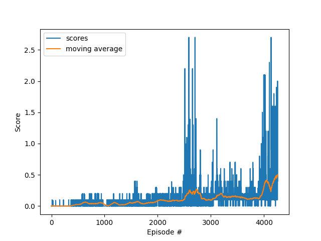

## Collaborate Compete Project Report

## Learning Algorithm

In this project, there are two agents, the goal is play tennis with each other and keep the ball in the air as long as
possible. Each agent has its own state observation (24 variables) of the environment, and 2 continuous movements as its
actions. Through interacting with the environment, the agent receives positive reward (+0.1) when it hits the ball over
the net, and -0.1 reward when the ball touches the ground or go out of bound.

In this project, we deploy the multi-agent DDPG strategy, where each agent has its own individual actor-critic network.
As described in
the [maddpg paper](https://proceedings.neurips.cc/paper/2017/file/68a9750337a418a86fe06c1991a1d64c-Paper.pdf). This
framework uses centralized training with decentralized execution.


It means during training, the critic will have the states and actions combined from both agents as input (24x2+2x2=52
variables) to the critic network, and output a single expected Q value. At the same time, the actor takes only agent's
own observation (24 variables) to generate an action (2 variables). This allows the policies to use extra information to
ease training, so long as this information is not used at test time.

During training, the agents are set to be competitive. It means the rewards will not be shared. It results in faster
training than cooperative scheme. An Ornstein-Uhlenbeck process with a decay of 0.98 is used to enhance exploration of
the agents at the beginning to ease training

BatchNorm is used at the beginning of each network, and gradient clipping of 0.1 is used for the actor network, which
improves the stability during training.

Hyperparameters:

```python
BUFFER_SIZE = int(1e6)  # replay buffer size
BATCH_SIZE = 64  # minibatch size
NUM_UPDATE_PER_CYCLE = 2  # number of batch updates per cycle
GAMMA = 0.99  # discount factor
TAU = 1e-3  # for soft update of target parameters
LR_ACTOR = 3.e-3  # learning rate of the actor
LR_CRITIC = 3.e-4  # learning rate of the critic
exponential_learning_decay = 0.999  # for both actor and critic networks

OU_noise_theta = 0.5
OU_noise_sigma = 0.1
```

#### Actor-Critic Network Architectures

Actor network (left) and Critic network (right) for both agents


### Plot of Rewards

The training will terminate once average score (taking the maximum of both agents) reaches 0.5 over +100 episodes.

The network converges in **4300** episodes.

The score per episode during training:



### Demo

Runing the trained model with no exploration noise


### Ideas for Future Work

- A huge amount of time was spent tuning hyper-parameters. In the end, training still takes too much episodes to
  converge. By further tuning the network architecture and hyperparameter, could further decrease training time.
- The environment is symmetric, so if the state variable can be more understandable, we can use just one actor-critic
  network for both agents, by flipping the state and action variable in someway. It will result in the agent play with
  himself, and in the end ease the training process.
